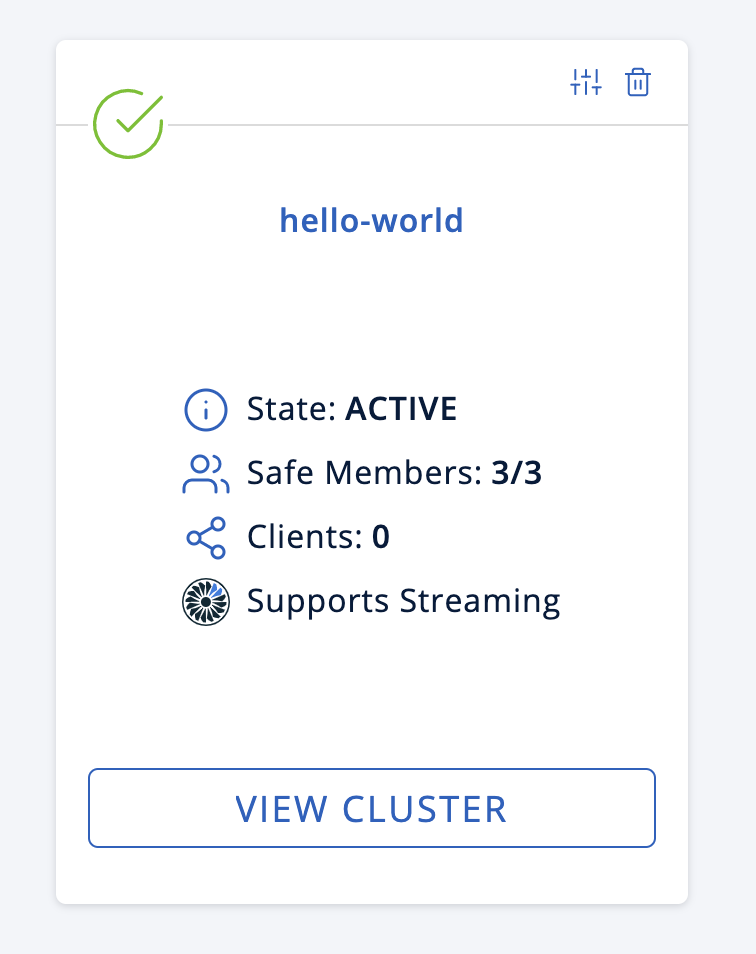
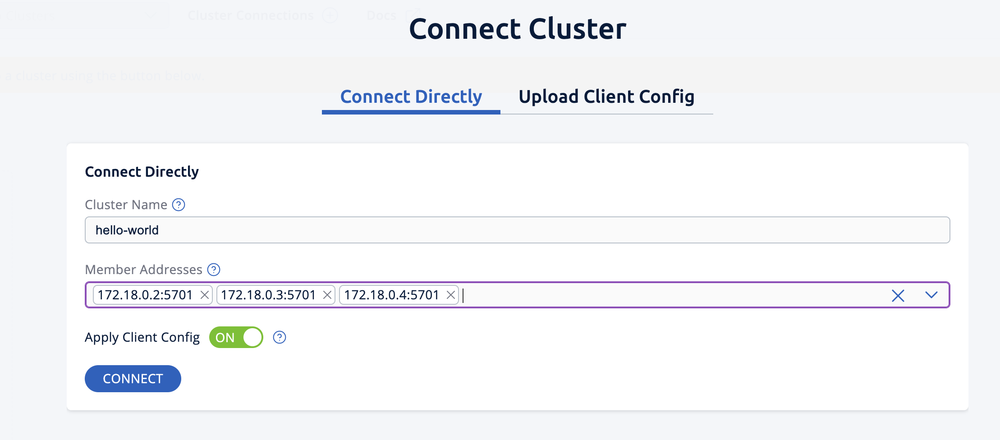

= Java Client
[[java-client]]

The Java client is **the most full featured** Hazelcast native client.
It is offered both with Hazelcast IMDG and Hazelcast IMDG Enterprise.
The main idea behind the Java client is to provide the same Hazelcast
functionality by proxying each operation through a Hazelcast member.

== New Vector Collection for building semantic search (BETA) [.enterprise]*Enterprise*

It can access and change distributed data and it can listen to distributed
events of an already established Hazelcast cluster from another Java application the link:https://prometheus.io/docs/prometheus/latest/configuration/configuration/#scrape_config[Prometheus configuration documentation].

TIP: For guidance, see the link:https://prometheus.io/docs/prometheus/latest/configuration/configuration/#scrape_config[Prometheus configuration documentation].

Content in document terminals in which the members are running or press terminals in which the members are running or press 

terminals in which the members are running or press kbd:[Ctrl+C] in each terminal.

.Full Hello world


Content in document

Content in document.



Content in document


Hundreds or even thousands of clients can be connected to the cluster.
By default, there are `core count * 20` threads on the server side that
handle all the requests, e.g., if the server has 4 cores, there will be 80 threads.

Imagine a trading application where all the trading data are stored and
managed in a Hazelcast cluster with tens of members. Swing/Web applications
at the traders' desktops can use clients to access and modify the data in the Hazelcast cluster.

== Getting Started with Java Client

NOTE: You do not need to set a license key for your Java clients for which you want to
use Hazelcast IMDG Enterprise features. Hazelcast IMDG Enterprise license keys are
required only for members.

Imagine a trading application where all the trading data are stored and
managed in a Hazelcast cluster with tens of members.

== Getting Started with Java Client

TIP: You do not need to set a license key for your Java clients for which you want to
use Hazelcast IMDG Enterprise features. Hazelcast IMDG Enterprise license keys are
required only for members.

Imagine a trading application where all the trading data are stored and
managed in a Hazelcast cluster with tens of members.

== Getting Started with Java Client

IMPORTANT: You do not need to set a license key for your Java clients for which you want to
use Hazelcast IMDG Enterprise features. Hazelcast IMDG Enterprise license keys are
required only for members.

Imagine a trading application where all the trading data are stored and
managed in a Hazelcast cluster with tens of members.

== Getting Started with Java Client

CAUTION: You do not need to set a license key for your Java clients for which you want to
use Hazelcast IMDG Enterprise features. Hazelcast IMDG Enterprise license keys are
required only for members.

Imagine a trading application where all the trading data are stored and
managed in a Hazelcast cluster with tens of members.

== Getting Started with Java Client or Maybe some other client

WARNING: You do not need to set a license key for your Java clients for which you want to
use Hazelcast IMDG Enterprise features. Hazelcast IMDG Enterprise license keys are
required only for members.


== Getting Started with Java Client

NOTE: You do not need to set a license key for your Java clients for which you want to
use Hazelcast IMDG Enterprise features. Hazelcast IMDG Enterprise license keys are
required only for members.

Imagine a trading application where all the trading data are stored and
managed in a Hazelcast cluster with tens of members.

== Getting Started with Java Client

TIP: You do not need to set a license key for your Java clients for which you want to
use Hazelcast IMDG Enterprise features. Hazelcast IMDG Enterprise license keys are
required only for members.

Imagine a trading application where all the trading data are stored and
managed in a Hazelcast cluster with tens of members.

== Getting Started with Java Client

IMPORTANT: You do not need to set a license key for your Java clients for which you want to
use Hazelcast IMDG Enterprise features. Hazelcast IMDG Enterprise license keys are
required only for members.

Imagine a trading application where all the trading data are stored and
managed in a Hazelcast cluster with tens of members.

== Getting Started with Java Client

CAUTION: You do not need to set a license key for your Java clients for which you want to
use Hazelcast IMDG Enterprise features. Hazelcast IMDG Enterprise license keys are
required only for members.

Imagine a trading application where all the trading data are stored and
managed in a Hazelcast cluster with tens of members.

== Getting Started with Java Client

WARNING: You do not need to set a license key for your Java clients for which you want to
use Hazelcast IMDG Enterprise features. Hazelcast IMDG Enterprise license keys are
required only for members.


== Getting Started with Java Client

Simply include the `hazelcast.jar` dependency in your classpath to start using
the Hazelcast Java client. Once included, you can start using this client as if
you are using the Hazelcast API. The differences are discussed in the below sections.

== Getting Started with Java Client

If you prefer to use Maven, simply add the `hazelcast` dependency
to your `pom.xml`, which you may already have done to start using
Hazelcast IMDG:

[source,xml,subs="attributes+"]
----
<dependency>
    <groupId>com.hazelcast</groupId>
    <artifactId>hazelcast</artifactId>
    <version>{page-component-display-version}</version>
</dependency>
----

You can find Hazelcast Java client's code samples https://github.com/hazelcast/hazelcast-code-samples/tree/master/clients[here^].

=== Client API

The first step is the configuration. You can configure the Java client declaratively or
programmatically. We use the programmatic approach for this section, as shown below.

[source,java]
----
ClientConfig clientConfig = new ClientConfig();
clientConfig.setClusterName("dev");
clientConfig.getNetworkConfig().addAddress("10.90.0.1", "10.90.0.2:5702");
----

See the <<configuring-java-client, Configuring Java Client section>> for more information.

[source,shell]
----
bin/hz-cli sql
----

== Getting Started with Java Client

The second step is initializing the `HazelcastInstance` to be connected to the cluster.

```
HazelcastInstance client = HazelcastClient.newHazelcastClient(clientConfig);
```

*This client interface is your gateway to access all Hazelcast distributed objects.*

Let's create a map and populate it with some data.

== Getting Started with Java Client

[source,java]
----
IMap<String, Customer> mapCustomers = client.getMap("customers"); //creates the map proxy

mapCustomers.put("1", new Customer("Joe", "Smith"));
mapCustomers.put("2", new Customer("Ali", "Selam"));
mapCustomers.put("3", new Customer("Avi", "Noyan"));
----

== Getting Started with Java Client

As the final step, if and when you are done with your client, you can shut it down as shown below:

```
client.shutdown();
```


== Test code source with annotations

You'll start the first member in a cluster called `hello-world`. Run the following Docker command:

[source,shell,subs="attributes+"]
----
docker run \
    --name first-member --network hazelcast-network \
    --rm \
    -e HZ_NETWORK_PUBLICADDRESS=<host_ip>:5701 \ # <.>
    -e HZ_CLUSTERNAME=hello-world \
    -e HZ_LICENSEKEY=<your license key> \# <.>
    -e HZ_PERSISTENCE_ENABLED=true \# <.>
    -e HZ_MAP_MYDISTRIBUTEDMAP_DATAPERSISTENCE_ENABLED=true \# <.>
    -v ~/persist:/opt/hazelcast/persistence \# <.>
    -p 5701:5701 hazelcast/hazelcast-enterprise:{ee-version}
----
<.> Replace the `<host_ip>` placeholder with the IP address of your Docker host.
<.> Replace the `<your license key>` placeholder with your Hazelcast {enterprise-product-name} license key.
<.> The environment variable to enable the persistence feature for the member
<.> The environment variable to enable the persistence feature for a map
<.> By default, the persistence feature creates the `/opt/hazelcast/persistence` directory to store the persisted data.
However, using a Docker image, you cannot create any files inside the container. This line of the command mounts a directory
on your local to the container, which in this case is `persist` under the home directory. This way, the container will use this local
directory to save the persisted data.


|===
|Column 1 |Column 2 |Column 3

^.>|The specifier for this cell is `^.>`.
The content is centered horizontally and aligned to the bottom of the cell.
|There aren't any alignment operators on this cell's specifier, so the cell falls back to the default alignments.
The default horizontal alignment is the left side of the cell.
The default vertical alignment is the top of the cell.
>.^|The specifier for this cell is `>.^`.
The content is aligned to the right side of the cell and centered vertically.

2.3+^.^|The specifier for this cell is `pass:[2.3+^.^]`.
It spans two columns and three rows.

Its content is centered horizontally and vertically.
3*.>|The specifier for this cell is `3*.>`.
The cell is duplicated in three consecutive rows in the same column.
It's content is aligned to the bottom of the cell.
|===


== Key features and benefits

[cols="<30%,<15%,<15%,<40%", options="header"]
|===
|[align=left]*Core Hazelcast Capabilities*|[align=left]*{enterprise-product-name}*|[align=left]*{open-source-product-name}*|[align=left]*Description*

|Management Center
|&#9989;
|&#10060;
|Get full access to all Management Center features.

|Management Center
|✅
|❌
|Get full access to all Management Center features.

|===
